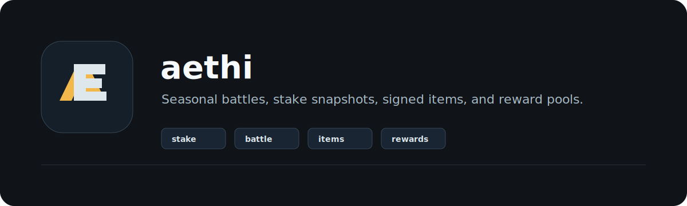
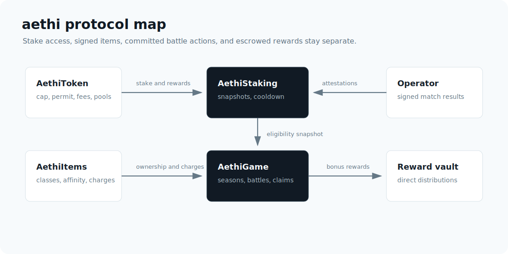

<p align="center">
  
</p>

<p align="center">
  <a href="#"></a>
  <a href="#"></a>
  <a href="#"></a>
</p>

# aethi

Aethi is a compact onchain game protocol for seasonal play.

Players stake AETHI, mint signed item NFTs, join live seasons, commit battle actions, earn resolved score, and claim rewards from season pools. The contracts keep token supply, item ownership, staking access, game state, and auxiliary rewards separated.

<p align="center">
  
</p>

## Protocol

| Module | Contract | Purpose |
| --- | --- |
| Token | `AethiToken` | Capped ERC20 with permit, pausing, and role-gated minting. |
| Items | `AethiItems` | ERC721 equipment with EIP-712 mint authorizations, classes, action affinity, and finite charges. |
| Staking | `AethiStaking` | Single-token staking vault with reward periods, reward-per-share accounting, and unstake cooldown. |
| Game | `AethiGame` | Season lifecycle, stake snapshots, battle action commits, signed result resolution, claims, cancellation, and dust sweep. |
| Rewards | `AethiRewardDistributor` | Controlled vault for direct reward distributions outside season pools. |

## Gameplay Loop

```text
Acquire AETHI
    ↓
Stake for access
    ↓
Mint signed equipment
    ↓
Join a season
    ↓
Equip item and commit battle action
    ↓
Resolve signed match result
    ↓
Claim season rewards
```

## Design

- Token and item logic use audited OpenZeppelin Contracts primitives.
- Item minting uses typed signatures, account nonces, deadlines, and capped boost power.
- Staking rewards use accumulated reward-per-share accounting and do not iterate over users.
- Season parameters and player stake are snapshotted so active seasons are not changed by later config updates.
- Battle rounds require player action commits and signed match results before resolution.
- Items can carry classes, action affinity, finite charges, and bounded boost power.
- Season rewards are escrowed when a season is created and paid pro-rata after finalization.
- Season managers can cancel not-yet-started seasons and sweep reward dust after the claim window.
- Privileged actions are split across admin, signer, operator, season, reward, and pause roles.
- The game contract does not use block values for randomness.

## Repository

```text
src/
  game/        Season and battle protocol
  interfaces/
  items/       Equipment NFTs
  rewards/     Direct reward vault
  staking/     Staking vault
  token/       AETHI token

docs/
  architecture.md
  game-mechanics.md
  economics.md
  operations.md
  threat-model.md
```

## Deployment

Set the variables in `.env.example`, then run the deployment script for the target network. The script deploys the five core contracts and connects `AethiItems` to `AethiGame`.

## Documentation

- [Architecture](docs/architecture.md)
- [Game mechanics](docs/game-mechanics.md)
- [Economics](docs/economics.md)
- [Operations](docs/operations.md)
- [Threat model](docs/threat-model.md)
- [Roadmap](docs/roadmap.md)

## Assets

- [Logo mark](docs/assets/aethi-logo-mark.svg)
- [Wordmark](docs/assets/aethi-wordmark.svg)
- [Banner](docs/assets/aethi-banner.svg)
- [Social preview](docs/assets/aethi-social-preview.svg)

## Status

Experimental. Review roles, monitoring, invariant tests, and independent audit coverage before production use.
